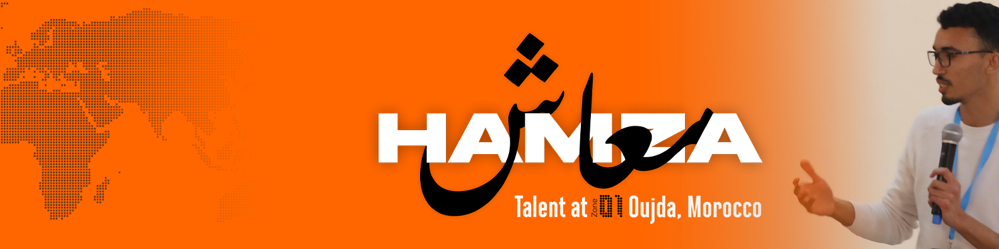

  

<!--

  

-->
 

<bold>Full-stack developer passionate about creating efficient and innovative solutions. Currently enhancing my skills at Zone01 Oujda as part of 01Talent.</bold>

&nbsp;

&nbsp;

## 💻 Tech Stack

&nbsp;

&nbsp;

&nbsp;

&nbsp;

  

&nbsp;

&nbsp;

&nbsp;

&nbsp;

  

&nbsp;

## 📈 GitHub Stats

## 🌱 Current Learning Focus

I'm currently improving my skills in:

&nbsp;

&nbsp;

## 🔍 Future Interests

Technologies I'm interested in exploring:

&nbsp;

&nbsp;

&nbsp;

&nbsp;

---

  
  *"Building the future, one line of code at a time."*
  

